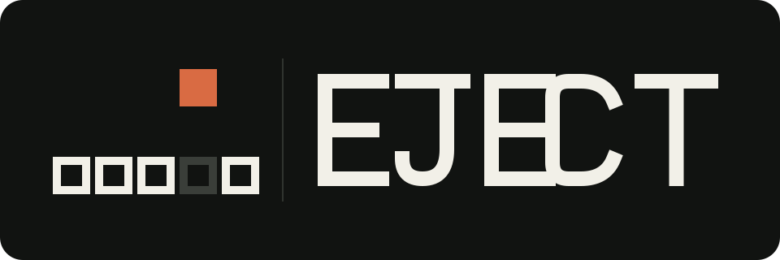

# EJECT ⏏

[日本語](README.ja.md)



> Serious technology. Almost no purpose.

EJECT is an IoT social network with almost no purpose. It lets your friends
eject the CD tray connected to your computer.

The product uses accounts, permissions, real-time networking, a native desktop
agent, and operating-system device APIs to create one tiny physical event:
somewhere, a tray opens.

## The idea

Most connected products justify themselves through convenience, automation, or
productivity. EJECT does not. Its value is the strange feeling that another
person, somewhere else, briefly touched your physical surroundings.

EJECT is not remote device administration. It is a one-bit physical social
network.

## Core experience

1. Create an account.
2. Install the EJECT desktop agent.
3. Register a compatible optical drive.
4. Invite a friend.
5. Explicitly allow that friend to eject you.
6. Your friend presses **EJECT**.
7. Your tray opens and the desktop tells you who did it.
8. You may eject them back.

```text
Kaz ejected you.

[ EJECT BACK ]
```

The tray—not the screen—is the primary interface.

## Product position

- **Name:** EJECT
- **Repository:** `eject`
- **Intended URL:** `https://eject.sasra.io`
- **Signature:** EJECT by sasra
- **Platform direction:** Windows first; macOS experimental
- **Initial locales:** English and Japanese
- **Current phase:** concept and product design; no production implementation yet

## Principles in brief

- Meaninglessness is the feature.
- One action creates one physical consequence.
- It must feel like a person, not automation.
- Consent comes before connection.
- Safety comes from having very little capability.
- Scarcity gives the action meaning.
- Never claim a physical event that did not happen.
- Build serious technology and present it deadpan.
- Do not become a platform too early.
- Do not surveil the recipient.
- Language is not the product boundary.

Read the complete [design principles](PRINCIPLES.md).

## Documentation

- [Product concept](docs/PRODUCT.md) / [日本語](docs/PRODUCT.ja.md)
- [Brand and language](docs/BRAND.md) / [日本語](docs/BRAND.ja.md)
- [Architecture direction](docs/ARCHITECTURE.md) / [日本語](docs/ARCHITECTURE.ja.md)
- [Security and privacy](docs/SECURITY.md) / [日本語](docs/SECURITY.ja.md)
- [Internationalization](docs/I18N.md) / [日本語](docs/I18N.ja.md)
- [Roadmap](docs/ROADMAP.md) / [日本語](docs/ROADMAP.ja.md)
- [Stage 0 Windows spike](docs/STAGE-0-WINDOWS-SPIKE.md) / [日本語](docs/STAGE-0-WINDOWS-SPIKE.ja.md)
- [Implementation handoff](docs/HANDOFF.md) / [日本語](docs/HANDOFF.ja.md)
- [References](docs/REFERENCES.md) / [日本語](docs/REFERENCES.ja.md)

## Platform notes

Windows exposes a supported device-control path for ejecting removable media,
which makes a tray-style optical drive the primary target.

macOS also provides disk-ejection APIs, but modern Macs usually depend on
external optical drives, many of which are slot-loading. macOS support is
therefore architecturally planned but remains experimental until physical tray
behavior is validated across real hardware.

## Scope

EJECT intentionally does not begin with a feed, posts, likes, chat, cameras,
microphones, arbitrary remote commands, scheduled actions, bots, or a general
IoT plug-in system. New features must preserve the smallness of the idea.

## License

No open-source license has been selected yet. Until one is added, all rights are
reserved.
