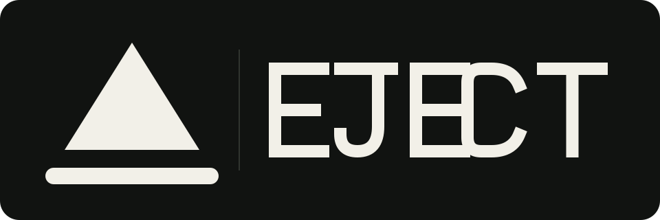
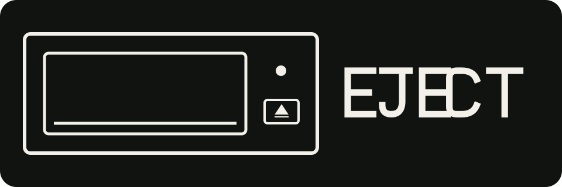
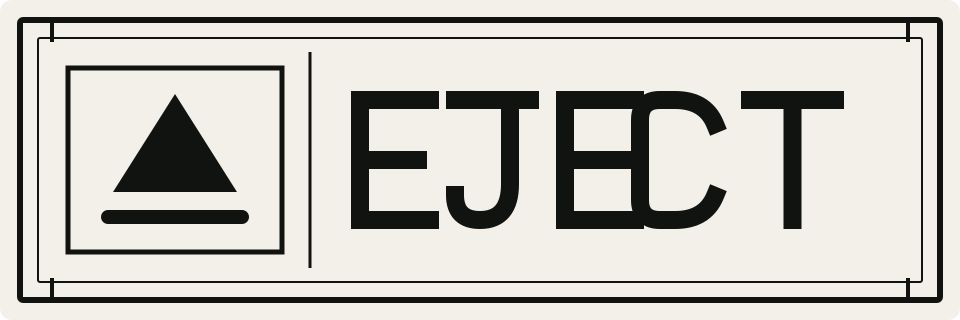
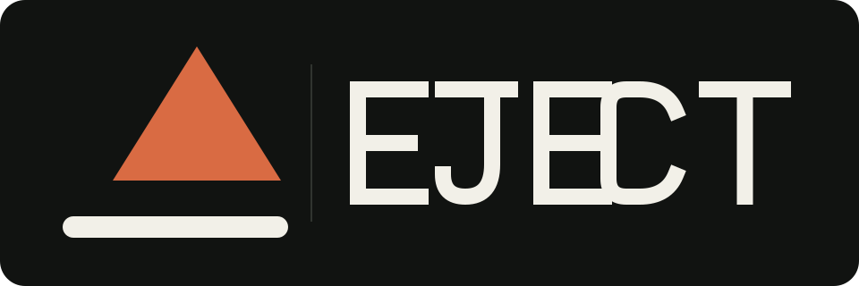
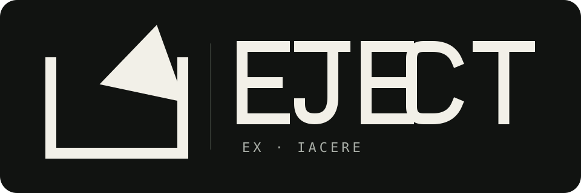
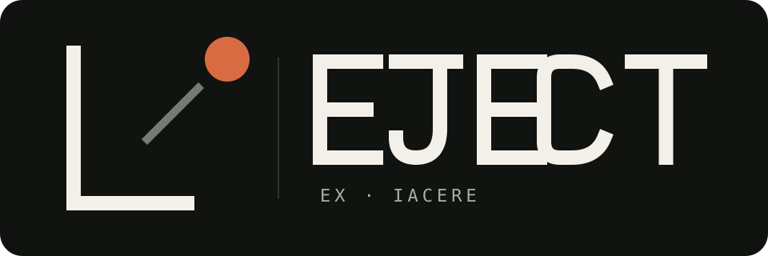
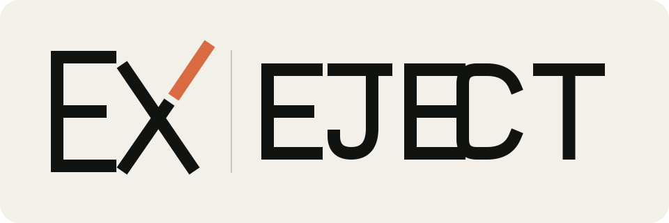
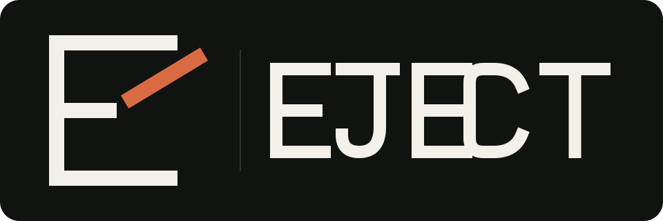
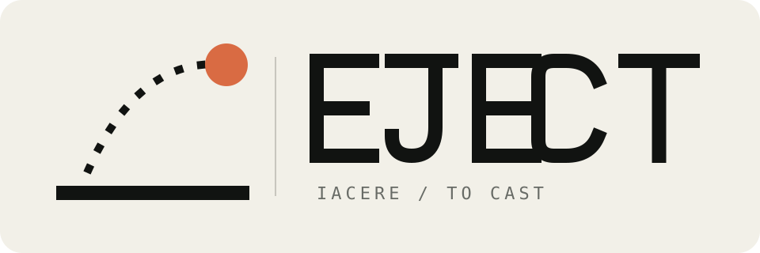
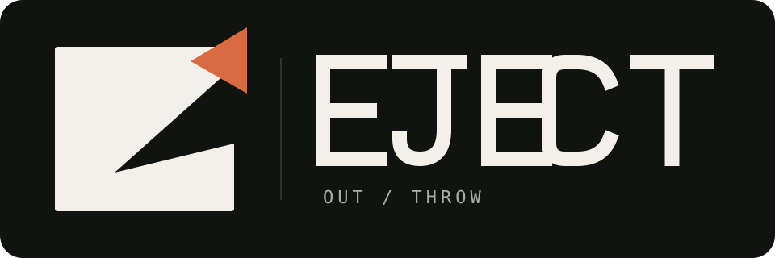

# EJECT ロゴ案

[English](README.md)

これらは検討中の案であり、採用済みのVIではありません。GitHubのライト／
ダーク両テーマで読めるよう、背景を含む独立したSVGロックアップとして制作
しています。周囲のREADMEを翻訳できるよう、タグラインは画像に埋め込んで
いません。

## 1. Tray Line

もっとも直接的な案です。標準的なイジェクト記号の下線を、物理的なトレイに
見える長さまで伸ばしました。コンパクトな単色で、製品の「物理的な1アクション」
という前提にもっとも近い案です。

## 2. Drive Faceplate

光学ドライブの前面を最小限の要素に還元した案です。READMEのヘッダーでは
製品の冗談がすぐ伝わりますが、小サイズでは他案より早く細部が失われます。

## 3. Institutional Label

機器や研究設備のラベルを思わせる、事務的で枠に収まった意図的に乾いた案です。
プロジェクトのデッドパンな語り口をもっとも強く表します。

## 4. Offset Eject

三角形をトレイからずらし、簡潔な1回の動きを表現しました。落ち着いたオレンジは
検討用で、形自体は単色でも成立します。

## 5. EX · IACERE

語源から組み立てた案です。英語の *eject* は、ラテン語の
*eicere*／*eiectus* に遡り、「外へ」を表す接頭辞と「投げる」を意味する
*iacere* から成ります。その古い意味を、開いた境界を斜めに越えて形が投げ出される
図として表しました。`EX · IACERE` は語根を説明する銘であり、製品名を置き換える
ものではありません。

参照: [Merriam-Webster](https://www.merriam-webster.com/dictionary/eject)、
[American Heritage Dictionary](https://www.ahdictionary.com/word/search.html?q=eject)。

## 推奨

最終候補として **Tray Line** と **EX · IACERE** をテストするのがよいと考えます。
Tray Lineは一目で明快で、EX · IACEREにはプロジェクト固有の物語があります。
Institutional Labelは、シンボルとして採用しない場合もレイアウトシステムとして
活用できます。

## 語源方向の追加スタディ

### E1. Thrown Point

物体を点まで、境界をL字まで還元し、「外へ投げる」だけを残した最小形です。

### E2. Broken EX

語根EXを直接モノグラム化し、Xの右上の一画だけを外へ飛ばします。

### E3. E Throws

Eの中棒が文字から離れ、そのまま投げられる物体になります。

### E4. Iacere Arc

矢印を使わず、物理的な基準線と一つの放物線で「投げる」を表します。

### E5. Negative Exit

塊から切り取られた形が境界外に再出現します。5案の中でもっとも抽象的な案です。
