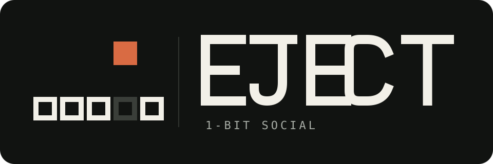
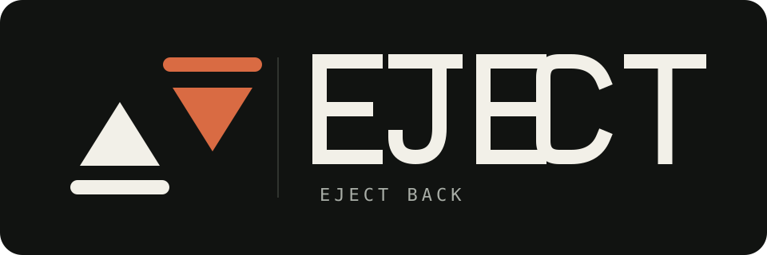
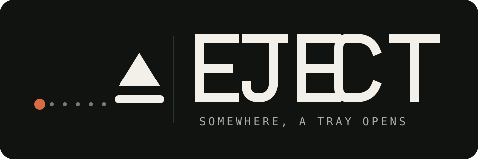
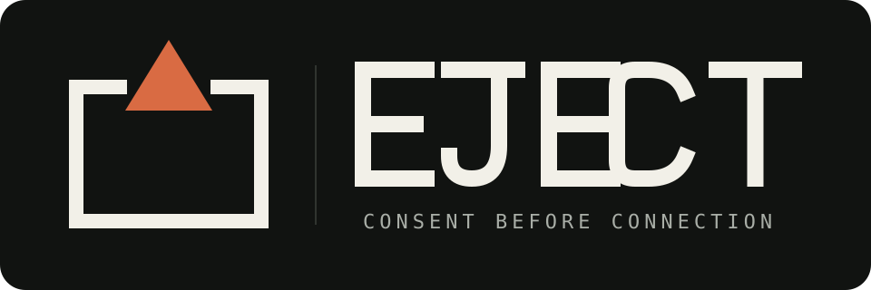
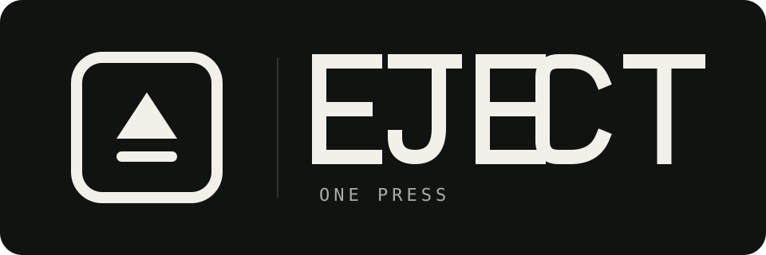

# EJECT logo concepts

[日本語](README.ja.md)

These are working concepts. They are drawn as self-contained SVG lockups so
they remain legible in both GitHub light and dark themes. No tagline is
embedded, allowing the surrounding README to remain localized.

> **Decision:** **One Bit** (S1, below) has been adopted as the direction.
> Production assets live in [`../logo/`](../logo/README.md).

## 1. Tray Line

The most direct candidate: the standard eject shape, with its lower line
extended into a physical tray. It is compact, monochrome, and closest to the
product's single-action premise.

## 2. Drive Faceplate

A reduced optical-drive front panel. It makes the joke legible immediately in a
README header, though it will lose detail sooner than the other marks at small
sizes.

## 3. Institutional Label

An equipment or laboratory label: factual, boxed, and deliberately dry. This is
the strongest expression of the project's deadpan voice.

## 4. Offset Eject

The triangle is displaced from the tray to show one concise motion. The muted
orange is exploratory; the form also works in one color.

## 5. EX · IACERE

An etymological route. English *eject* descends through Latin *eicere*/*eiectus*,
formed from a prefix meaning “out” and *iacere*, “to throw.” The mark renders
that older idea as a form cast diagonally through an open boundary. `EX · IACERE` is used
as an explanatory root inscription, not as a replacement product name.

References: [Merriam-Webster](https://www.merriam-webster.com/dictionary/eject),
[American Heritage Dictionary](https://www.ahdictionary.com/word/search.html?q=eject).

## Recommendation

Test **Tray Line** and **EX · IACERE** as the finalists. Tray Line is clearer at
first glance; EX · IACERE gives the project a more ownable story. Institutional
Label is a useful layout system even if its symbol is not selected.

## Further etymology studies

### E1. Thrown Point

The root meaning reduced to a boundary, trajectory, and point.

### E2. Broken EX

An EX monogram whose upper-right stroke is cast out.

### E3. E Throws

The middle arm of the E detaches and becomes the thrown object.

### E4. Iacere Arc

A physical baseline and one ballistic arc, without an arrow.

### E5. Negative Exit

A removed wedge reappears outside the solid boundary. This is the most abstract
of the five studies.

## Social studies

The concepts so far cover hardware (01–04) and etymology (05–10). These five
address the third axis: EJECT as a one-bit physical social network — people,
consent, and remote presence.

### S1. One Bit

A single bit leaves its slot in a bit field and is ejected upward. "One action,
one physical result," expressed in the smallest unit of data.

### S2. Eject Back

Two eject symbols facing each other: one ejects, the other ejects back. The
core reciprocal experience, expressed only by inverting the mark.

### S3. Somewhere

A dotted signal travels from a remote point across distance, and a tray opens.
A literal drawing of the sentence "Somewhere, a tray opens."

### S4. Consent Gate

The top edge of a boundary has been deliberately opened; the form can leave
only through that opened gap. A diagram of "consent before connection."

### S5. One Press

A single keycap carrying the eject symbol — the one action a friend performs,
drawn from the sender's side.
